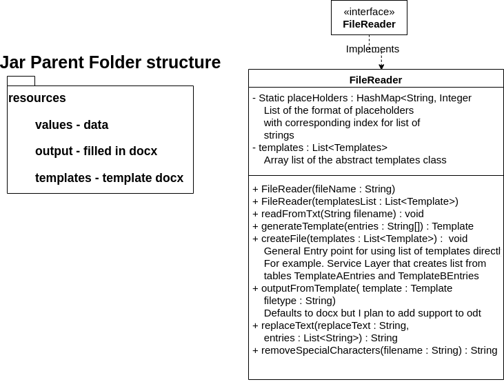

# `FileReader` Class Documentation

## Overview

The `FileReader` class is used to read files and manipulate their content. This class implements the `IFileReader` interface and provides various functionalities such as reading from a text file, generating a template, creating files, and producing output from a given template.

Methods are separated by each performing one function. `readFromTxt()` and `generateTemplate()` are used to format the file based on the text File. `createFiles()` uses the List of abstract templates if you want to reuse this code from another datasource. For example a middleware server might call a service object to get a list from a database query.



# How to build  and run jar

In the unzipped source code run 
```bash
mvn clean package
```
* Will place new MergeTemplate.jar inside /src/target/ directory
* Move to parent directory where resources folder is located
* run this or open run.sh in bash
```
java -jar MergeTemplates.jar
```

---

## Class Definition

```java
public class FileReader implements IFileReader{
    // Class Body
}
```

---

## Constructors

### `FileReader(String filename)`

This constructor reads from a text file and initializes the `FileReader` object.

**Parameters**

- `filename`: The name of the file to read from.

**Example**

```java
FileReader fileReader = new FileReader("myFile.txt");
```

### `FileReader(List<Template> templatesList)`

This constructor initializes the `FileReader` object with a list of templates.

**Parameters**

- `templatesList`: The list of templates to initialize the `FileReader`.

**Example**

```java
List<Template> templatesList = new ArrayList<>();
FileReader fileReader = new FileReader(templatesList);
```

---

## Methods

### `public void readFromTxt(String filename)`

This method reads content from a text file.

**Parameters**

- `filename`: The name of the file to read from.

### `public Template generateTemplate(String[] entries)`

This method generates a new template based on the given entries.

**Parameters**

- `entries`: An array of strings that define the template.

**Return**

- Returns a `Template` object.

### `public void createFiles(List<Template> templates)`

This method creates files based on the given list of templates.

**Parameters**

- `templates`: A list of templates used to create files.

### `public void outputFromTemplate(Template template, String filetype)`

This method produces an output from the given template and filetype.

**Parameters**

- `template`: A `Template` object used to generate the output.
- `filetype`: The type of file to output.

### `public String replaceText(String paragraph, List<String> entries)`

This method replaces the text in a paragraph based on a list of entries.

**Parameters**

- `String`: The `String` object whose text is to be replaced.
- `entries`: A list of strings used to replace the text.

**Return**

- Returns an `String` object.

### `public static String getPath(String directory)`

This static method gets the path of the given directory.

**Parameters**

- `directory`: The directory whose path is required.

**Return**

- Returns a `String` representing the path.

### `public static String removeSpecialCharaters(String fileName)`

This static method removes special characters from the given file name.

**Parameters**

- `fileName`: The name of the file from which special characters are to be removed.

**Return**

- Returns a `String` representing the new filename.

---

## Getter and Setter

### `public List<Template> getTemplates()`

This method returns the list of templates.

**Return**

- Returns a list of `Template` objects.

### `public void setTemplates(List<Template> templates)`

This method sets the list of templates.

**Parameters**

- `templates`: The new list of templates.
