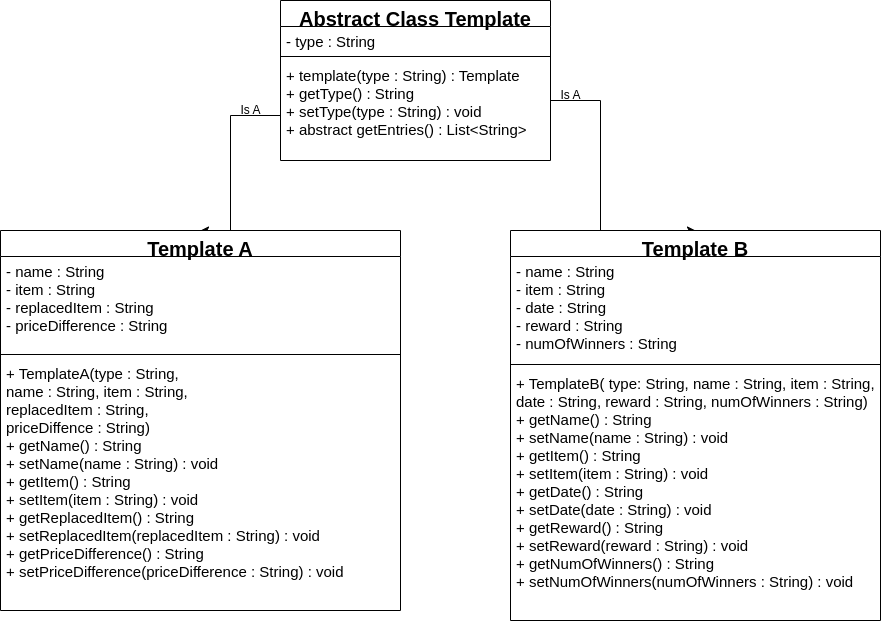

# `Template` Class Documentation

## Overview

The `Template` class is an abstract class that provides a framework for creating different types of templates. It includes an abstract method `getEntries()`, which is meant to be overridden by the subclasses. 

The `TemplateA and TemplateB` class are concrete subclasses of `Template` that provides specific implementation for the `getEntries()` method. It is used to represent a particular type of template and defines additional properties such as name, item, replaced item, and price difference.



---

## Class Definitions

### `Template`

```java
public abstract class Template {
    // Class Body
}
```

### `TemplateA`

```java
public class TemplateA extends Template {
    // Class Body
}
```

---

## Constructors

### `Template(String type)`

This constructor initializes the `Template` object with a type.

**Parameters**

- `type`: The type of the template.

### `TemplateA(String type, String name, String item, String replacedItem, String priceDifference)`

This constructor initializes the `TemplateA` object with specific properties.

**Parameters**

- `type`: The type of the template.
- `name`: The name associated with the template.
- `item`: The item associated with the template.
- `replacedItem`: The item being replaced by the new item.
- `priceDifference`: The price difference between the original item and the replaced item.

**Example**

```java
TemplateA templateA = new TemplateA("TypeA", "John", "Item1", "Item2", "$10");
```

---

## Methods

### `public abstract List<String> getEntries()`

This method is declared in the `Template` class and is meant to be overridden by subclasses. It retrieves a list of entries associated with a template.

### `public List<String> getEntries()`

This method is implemented in the `TemplateA` class. It uses reflection to retrieve the value of all declared fields in the `TemplateA` class, adds them to a list, and returns the list.

**Return**

- Returns a list of strings representing the values of all declared fields in the `TemplateA` class.

**Example**

```java
TemplateA templateA = new TemplateA("TypeA", "John", "Item1", "Item2", "$10");
List<String> entries = templateA.getEntries();
```